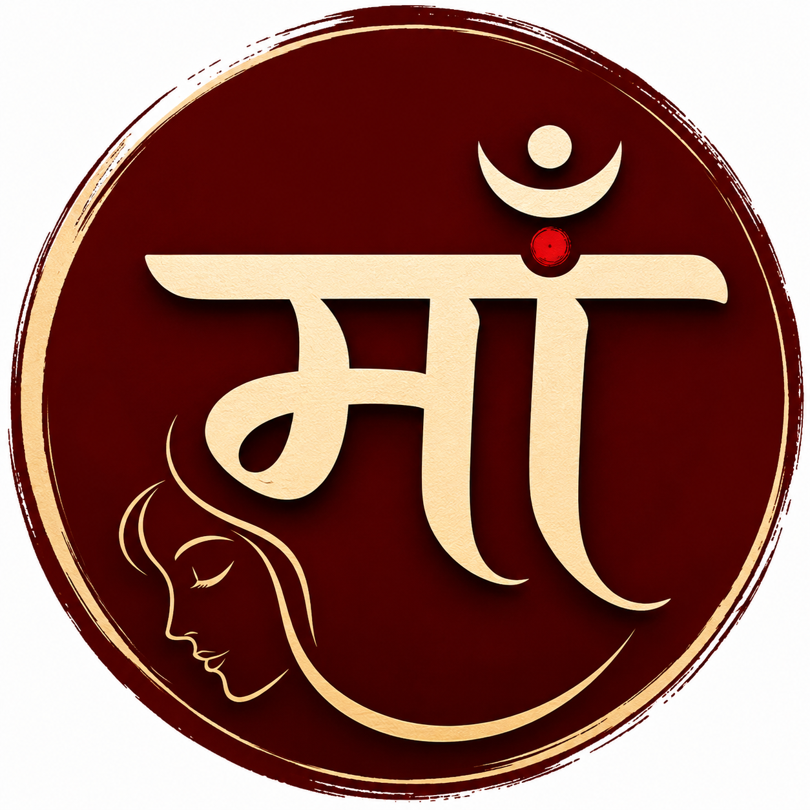

<div align="center">

# 🎵 माँ साउंड पार्लर — DUNIYA



### "आज कहाँ बैठोगे?"

**An immersive, nostalgic Indian music and community experience.**

[](https://live-maa-sound-parlor.vercel.app)

</div>

---

## 🪔 About The Project

**माँ साउंड पार्लर — DUNIYA** is not just a music player; it is an atmospheric time machine. Inspired by the nostalgia of old Indian neighbourhoods, roadside shops, window seats on train journeys, breezy rooftops, and golden 90s memories.

Instead of selecting a playlist, you choose a **Duniya (World)**. 

Each world offers a curated combination of:
- 🎬 **Cinematic Backgrounds** — Fullscreen immersive looping visuals.
- 🎵 **Curated Music** — Seamlessly integrated YouTube playlists matching the vibe.
- 💬 **Global Live Chat** — *"यहाँ हर कोई थोड़ा अपना है।"* Connect with other listeners in real-time across all Duniyas.
- ✨ **Atmospheric UI** — Glassmorphism, smooth animations, and elegant Hindi typography.

---

## ✨ Features

- **Immersive Worlds (दुनिया):** Choose from beautifully crafted environments like *'General Dibba'* (🚂), *'Pehli Cutting'* (☕), *'Manokamna Mandir'* (🚩), and many more.
- **Global Real-time Chat:** A fully functional, real-time community chat floating elegantly over the experience. Features unread badges, message history, and a local clear function.
- **Smart Playback Memory:** The app intelligently remembers your active world and the exact song you were listening to. If you reload the page, you're right back where you left off.
- **Premium Custom UI:** Carefully crafted glassmorphism components, floating popover navigation, responsive layouts across all devices, and buttery smooth page transitions.
- **Keyboard Shortcuts:** Control the immersive music player right from your keyboard (Space to Play/Pause, Arrows to Skip, 'M' to Mute).

---

## 🛠️ Tech Stack

Built with cutting-edge modern web technologies:

- **Framework:** [Next.js 16](https://nextjs.org/) (App Router)
- **Styling:** [Tailwind CSS v4](https://tailwindcss.com/) (Leveraging the latest modern shorthand classes)
- **Animations:** [Framer Motion](https://www.framer.com/motion/) (Fluid layout transitions and presence animations)
- **Backend & Realtime:** [Supabase](https://supabase.com/) (PostgreSQL Database, Realtime Subscriptions)
- **Media:** [React YouTube](https://github.com/tjallingt/react-youtube) (Headless YouTube Iframe API wrapper)
- **Icons:** [Lucide React](https://lucide.dev/)
- **Language:** [TypeScript](https://www.typescriptlang.org/) (Strict typing across components and data structures)

---

## 🚀 Getting Started

To run this project locally:

### 1. Clone the repository
```bash
git clone https://github.com/yourusername/maa-sound-parlour.git
cd maa-sound-parlour
```

### 2. Install dependencies
```bash
npm install
```

### 3. Setup Environment Variables
Create a `.env.local` file in the root directory and add your Supabase credentials:
```env
NEXT_PUBLIC_SUPABASE_URL=your_supabase_project_url
NEXT_PUBLIC_SUPABASE_ANON_KEY=your_supabase_anon_key
```

### 4. Run the development server
```bash
npm run dev
```
Open [http://localhost:3000](http://localhost:3000) with your browser to experience the Duniyas.

---

<div align="center">
  <p><i>"हर दुनिया, एक अलग एहसास ।।।"</i></p>
  <p>Crafted with ❤️ for nostalgia and music.</p>
</div>